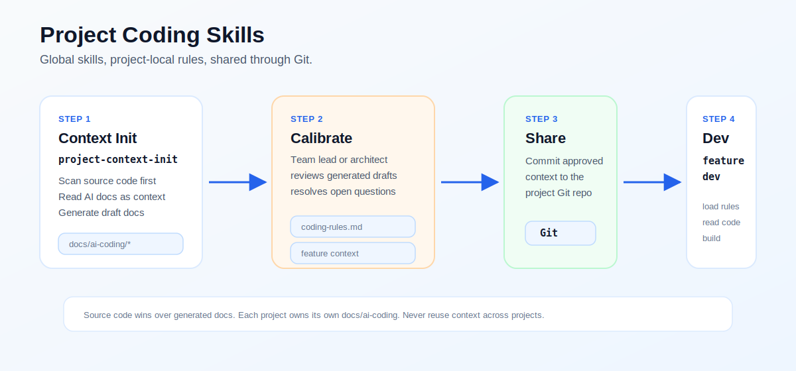

# Project Coding Skills

Reusable AI coding skills for project-local context initialization and feature development.

English | [简体中文](./README.zh.md)



This project helps AI coding agents work with the rules of the current repository instead of carrying assumptions from another project. The core idea is simple:

> Skills are global. Project rules are local.

## Why

AI coding tools are powerful, but a team usually has project-specific conventions:

- architecture style
- package layout
- controller/service/repository boundaries
- testing habits
- API conventions
- existing AI-generated specs and plans
- code review expectations

Those rules should not live in every developer's personal prompt. They should live in the project repository and be shared by the whole team.

## MVP Skills

This repository currently contains two MVP skills:

```text
skills/
  project-context-init/
  project-feature-dev/
```

### `project-context-init`

Alias: `develop:init`

Use this skill to initialize or refresh project-local AI coding context.

It scans the current project, treats source code as the source of truth, reads existing AI-generated documents as supporting context, classifies prompt templates separately, and generates:

```text
docs/ai-coding/
  project-profile.md
  architecture-summary.md
  coding-rules.md
  ai-context-sources.md
  feature-prompt-context.md
  open-questions.md
```

These files belong to the target business project, not this skill repository.

### `project-feature-dev`

Alias: `develop:feature`

Use this skill before implementing a feature.

It resolves the current project root, loads only that project's `docs/ai-coding/`, reads related source code, finds similar implementations, and then proceeds with feature work using the current project's rules.

It does not replace brainstorming or design workflows. It loads project context before those workflows run.

## Core Principles

```text
Source code is the source of truth.
AI-generated docs are context, not authority.
Each project owns its own docs/ai-coding/.
Never reuse context from another project.
Commit docs/ai-coding/ to the target project's Git repository.
Use project-feature-dev after the team lead or architect has reviewed the generated context.
```

## Installation

### Install with Skills CLI

```bash
npx skills add huajiexiewenfeng/project-coding-skills
```

For local development from this repository root:

```bash
npx skills add .
```

After installation, restart Codex or your agent runtime so the skills can be rediscovered.

### Manual Install

If your tool does not support installing skills from GitHub, copy the two skill folders into your local skills directory.

For Codex-style local skills, the structure should remain:

```text
skills/
  project-context-init/
    SKILL.md
    references/

  project-feature-dev/
    SKILL.md
    references/
```

## Usage

### 1. Initialize a project

In a business project repository:

```text
Use develop:init to initialize this project's AI coding context.
```

For daily use, keep the prompt short and provide only the project-specific scope:

```text
Use develop:init for the current project.
Core workspace:
<module-or-path>

Reference area:
<module-or-path>

Optional context:
<docs, prompt template, or feature focus>
```

By default, the current folder is the project root, source code is authoritative, only `docs/ai-coding/` is generated or updated, and production code is not modified.

The skill generates `docs/ai-coding/` in that project.

On first run, `project-context-init` creates the project-local context directory and starter templates:

```text
docs/ai-coding/
docs/ai-coding/prompt-templates/feature-intake-template.md
docs/ai-coding/prompt-templates/feature-intake-template.zh.md
```

New users do not need to know the skill's internal reference files. They only edit the generated project-local files when the skill asks for calibration.

If `docs/ai-coding/` already exists, `develop:init` runs in update mode. It reads the existing context first, preserves reviewed project guidance and prompt templates, then merges newly observed source facts instead of starting over.

### 2. Calibrate and approve the context

`project-context-init` generates a draft. Before the team uses it for feature development, a team lead or architect should review and adjust the generated files.

Review especially:

```text
docs/ai-coding/open-questions.md
docs/ai-coding/coding-rules.md
docs/ai-coding/feature-prompt-context.md
```

The reviewer should:

- resolve or explicitly keep items in `open-questions.md`
- correct project-specific rules in `coding-rules.md`
- refine the reusable team prompt in `feature-prompt-context.md`
- decide whether discovered prompt templates should be adopted, filled first, merged with the default template, partially used, or skipped
- commit the approved `docs/ai-coding/` to the business project's Git repository

After that commit, every team member and AI agent uses the same context.

### 3. Develop a feature

In the same business project:

```text
Use develop:feature to implement this requirement: ...
```

The skill loads only the current project's `docs/ai-coding/` and follows that project's coding style.

`project-feature-dev` includes a default feature intake template. Project teams may override it with approved templates under `docs/ai-coding/prompt-templates/`, or provide candidate templates under `docs/prompt-template/`. User-specified templates for the current task have the highest priority.

## Existing AI Documents

`project-context-init` can read existing AI-generated context, including:

```text
docs/superpowers/specs/
docs/superpowers/plans/
graphify-out/GRAPH_REPORT.md
graphify-out/graph.json
docs/ai-coding/
docs/ai-coding/prompt-templates/
docs/prompt-template/
docs/**/*.md
*.design.md
*.plan.md
*-design.md
*-plan.md
*prompt*.md
```

Important: these documents are supporting context only. If they conflict with source code, source code wins. Prompt templates with placeholders are registered as feature-intake templates; the user or architect decides whether to adopt them, fill them first, merge them with the default template, use only stable verified parts, or skip them.

## Repository Layout

```text
skills/
  project-context-init/
    SKILL.md
    references/
      output-templates.md
      source-scan-guide.md
      ai-doc-discovery.md

  project-feature-dev/
    SKILL.md
    references/
      default-feature-intake-template.md
      default-feature-intake-template.zh.md
      feature-workflow.md
      final-response-template.md
```

## Status

This project is in MVP stage.

Current focus:

- project context initialization
- project-local feature development context loading
- source-first rules
- project isolation
- Git-shared team context

Future extensions may include bugfix, review, database change, risk check, and context refresh skills.
