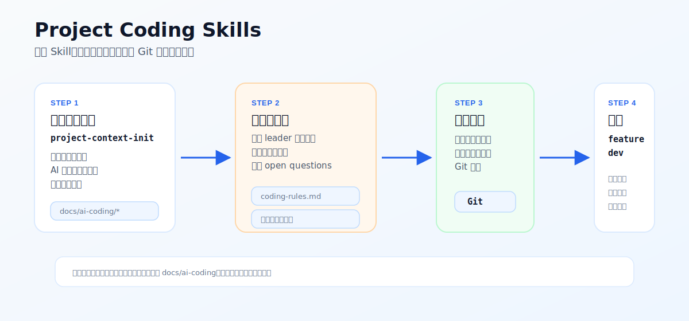

# Project Coding Skills

一组用于 AI 编码团队的项目级 skills，帮助 AI 在不同项目中自动加载各自的项目上下文和编码规则。

[English](./README.md) | 简体中文



这个项目的核心思想很简单：

> Skill 是全局通用的，项目规则是项目本地的。

## 为什么需要这个项目

AI 编码工具很强，但真实团队的项目往往有自己的规则：

- 架构风格
- 包结构
- Controller / Service / Repository 边界
- 测试习惯
- API 约定
- 已有 AI 生成的设计文档和计划文档
- Code Review 要求

这些规则不应该散落在每个开发者自己的长 prompt 里，而应该放在项目仓库中，由团队共享。

## MVP Skills

当前第一版只包含两个核心 skill：

```text
skills/
  project-context-init/
  project-feature-dev/
```

### `project-context-init`

团队口令：`develop:init`

用于初始化或刷新当前项目的 AI 编码上下文。

它会扫描当前项目，以源码为第一事实来源，读取已有 AI 生成文档作为辅助上下文，单独识别 prompt 模板，并在业务项目中生成：

```text
docs/ai-coding/
  project-profile.md
  architecture-summary.md
  coding-rules.md
  ai-context-sources.md
  feature-prompt-context.md
  open-questions.md
```

这些文件属于目标业务项目，不属于本 skill 仓库。

### `project-feature-dev`

团队口令：`develop:feature`

用于功能开发前加载当前项目的上下文。

它会先确定当前项目根目录，只读取当前项目自己的 `docs/ai-coding/`，再阅读相关源码、寻找相似实现，并带着当前项目的规则进入功能开发。

它不替代 brainstorming 或设计流程。它的职责是在设计和编码前加载项目上下文。

## 核心原则

```text
源码是第一事实来源。
AI 生成文档只是上下文，不是权威。
每个项目拥有自己的 docs/ai-coding/。
禁止复用其他项目的上下文。
docs/ai-coding/ 应提交到目标项目的 Git 仓库。
应在团队 leader 或架构师校准后，再使用 project-feature-dev 进行功能开发。
```

## 安装方式

### 使用 Skills CLI 安装

```bash
npx skills add huajiexiewenfeng/project-coding-skills
```

如果在本仓库根目录做本地开发：

```bash
npx skills add .
```

安装后，重启 Codex 或你的 Agent 运行环境，让 skills 被重新发现。

### 手动安装

如果你的工具不支持从 GitHub 安装 skills，可以将这两个 skill 目录复制到本地 skills 目录。

对于 Codex 风格的本地 skills，请保持目录结构：

```text
skills/
  project-context-init/
    SKILL.md
    references/

  project-feature-dev/
    SKILL.md
    references/
```

## 使用方式

### 1. 初始化业务项目

在业务项目仓库中执行：

```text
使用 develop:init 初始化这个项目的 AI 编码上下文。
```

日常使用时，prompt 应该尽量短，只补充当前项目真正不同的信息：

```text
使用 develop:init 初始化当前项目。
核心工作区：
<模块或路径>

参考区：
<模块或路径>

可选补充：
<文档、prompt 模板或本次关注功能>
```

默认情况下，当前文件夹就是项目根目录，源码是第一事实来源，skill 只生成或更新 `docs/ai-coding/`，不会修改业务代码。

skill 会在当前业务项目中生成：

```text
docs/ai-coding/
```

生成文档的内容会跟随 prompt 语言。中文 `develop:init` 会生成中文标题、说明和 review 项，但文件名、代码标识符、路径、命令保持不变。

第一次运行时，`project-context-init` 会自动创建项目本地上下文目录和 starter 模板：

```text
docs/ai-coding/
docs/ai-coding/prompt-templates/feature-intake-template.md
docs/ai-coding/prompt-templates/feature-intake-template.zh.md
```

新用户不需要知道 skill 内部的参考文件在哪里。需要校准时，只修改生成到业务项目里的这些文件。

如果 `docs/ai-coding/` 已经存在，`develop:init` 会进入 update 模式。它会先读取已有上下文，保留已经 review 过的项目规则和 prompt 模板，再增量合并新观察到的源码事实，而不是从头重建。

### 2. 校准并批准上下文

`project-context-init` 生成的是草稿。团队正式使用它开发功能之前，需要由团队 leader 或架构师 review 并调整生成文件。

重点 review：

```text
docs/ai-coding/open-questions.md
docs/ai-coding/coding-rules.md
docs/ai-coding/feature-prompt-context.md
```

review 人需要：

- 处理或明确保留 `open-questions.md` 中的问题
- 修正 `coding-rules.md` 中的项目规则
- 调整 `feature-prompt-context.md` 中的团队通用 prompt
- 判断发现到的 prompt 模板是直接采用、补齐后采用、和默认模板合并、只采用稳定部分，还是跳过
- 将批准后的 `docs/ai-coding/` 提交到业务项目 Git 仓库

提交后，团队所有成员和 AI Agent 才使用同一份上下文。

### 3. 开发功能

在同一个业务项目中执行：

```text
使用 develop:feature 帮我实现这个需求：...
```

skill 会加载当前项目自己的 `docs/ai-coding/`，并按照当前项目的编码风格和规则推进功能开发。

`project-feature-dev` 内置一个默认功能输入模板。团队可以在 `docs/ai-coding/prompt-templates/` 中放批准后的项目模板，也可以在 `docs/prompt-template/` 中放候选模板。本次任务中用户显式指定的模板优先级最高。

## 已有 AI 文档

`project-context-init` 可以读取已有 AI 生成上下文，例如：

```text
docs/superpowers/specs/
docs/superpowers/plans/
graphify-out/GRAPH_REPORT.md
graphify-out/graph.json
docs/ai-coding/
docs/ai-coding/prompt-templates/
docs/prompt-template/
docs/**/*.md
*.design.md
*.plan.md
*-design.md
*-plan.md
*prompt*.md
```

注意：这些文档只是辅助上下文。如果它们和源码冲突，以源码为准。带占位符的 prompt 模板会被登记为功能开发输入模板，由用户或架构师决定直接采用、补齐后采用、和默认模板合并、只采用已验证的稳定部分，还是跳过。

## 仓库结构

```text
skills/
  project-context-init/
    SKILL.md
    references/
      output-templates.md
      source-scan-guide.md
      ai-doc-discovery.md

  project-feature-dev/
    SKILL.md
    references/
      default-feature-intake-template.md
      default-feature-intake-template.zh.md
      feature-workflow.md
      final-response-template.md
```

## 当前状态

本项目目前处于 MVP 阶段。

当前重点：

- 项目上下文初始化
- 功能开发前加载项目本地上下文
- 源码优先
- 项目隔离
- Git 共享团队上下文

后续可以扩展 bugfix、review、database change、risk check、context refresh 等 skills。
